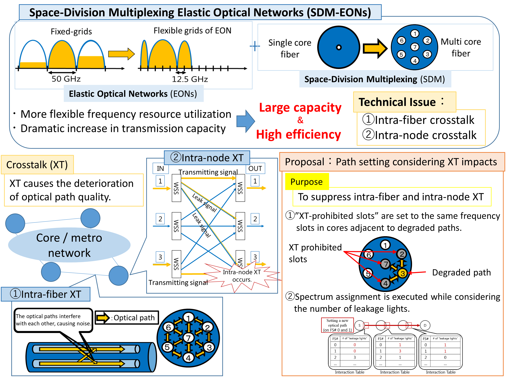
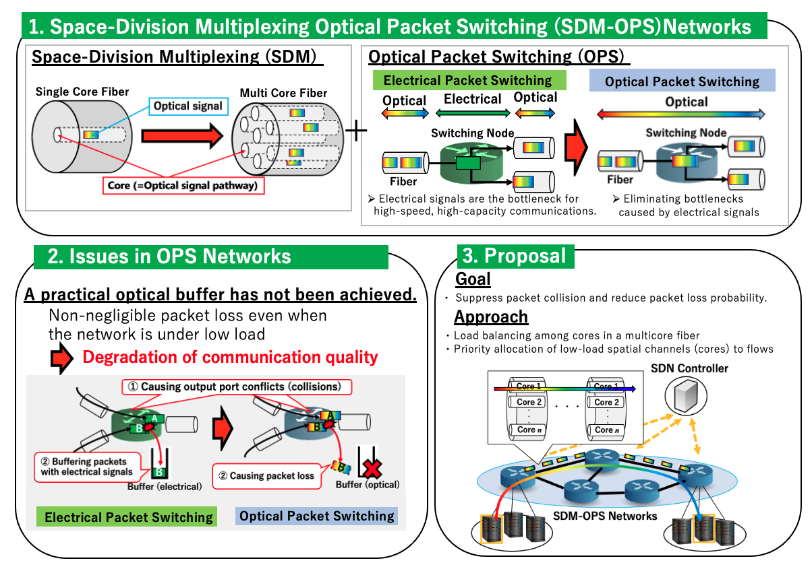
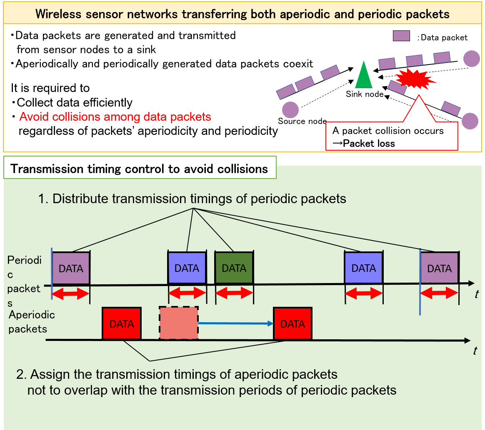
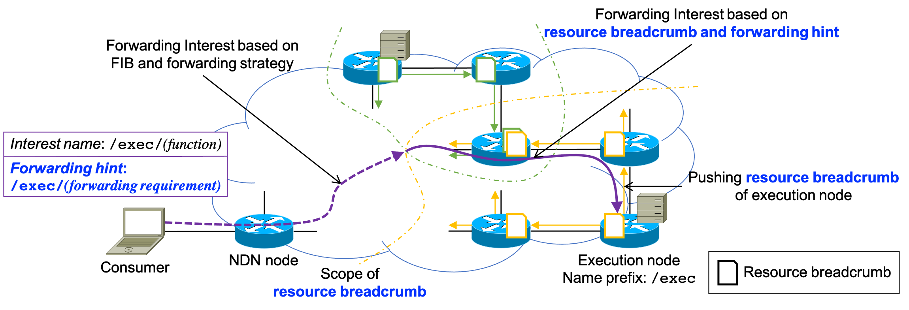
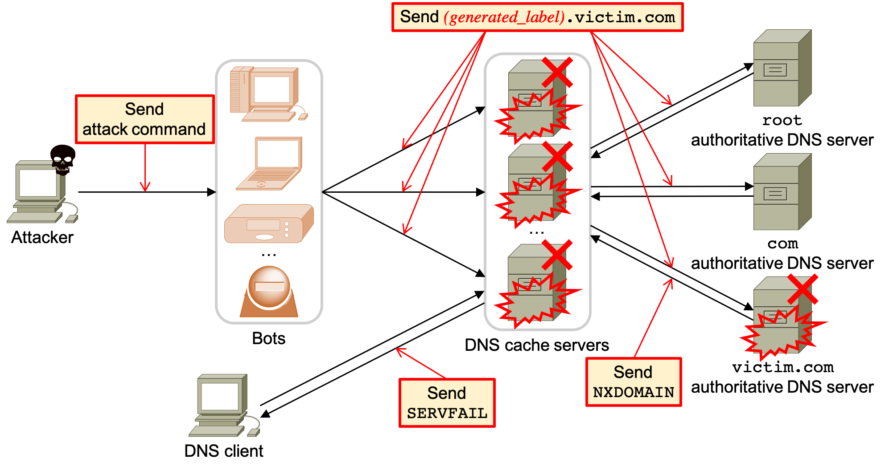

# 
 <h1>Projects</h1> 

### <u>Optical Networking</u>
#### A Study on Spectrum Assignment Considering Crosstalk Impacts at Both Fibers and Nodes in Space-Division Multiplexing Elastic Optical Networks

	<figure>
		
		<figcaption>Overview of proposed method.</figcaption>
	</figure>

Space-Division Multiplexing Elastic Optical Networks (SDM-EONs) have been studied for dramatically increasing traffic. However, in multi-core fiber environments, optical paths are influenced by other optical paths transmitted in the same frequency slots of the adjacent cores, and as a result, intra-fiber crosstalk (XT) could be generated. In addition to this, intra-node XT occurs at optical switching nodes. This means that the "leakage light" from an input port reaches the output ports other than the intended output port, and interferes with other optical paths transmitted via any of the not intended output ports in the same frequency slot. Two types of XT cause the deterioration of optical path quality. As a method to solve the intra-fiber crosstalk, we have proposed XT-Aware First-Fit (FF) which introduced the concept of prohibited area for the purpose of protecting optical paths that maybe deteriorated with smaller calculating complexity. In addition to it, by introducing the concept of "node interaction cost" into XT-Aware FF, we propose a method to prevent the influence of both intra-node XT and intra-fiber XT. By preventing the setting of optical paths which is expected to be affected largely by intra-node XT, the deterioration of quality of optical paths is avoided.

#### A Study on Collision-Aware Flow-Based Adaptive Resource Assignment for Space-Division Multiplexing Optical Packet Switching Networks

	<figure>
		
		<figcaption>Overview of proposed method.</figcaption>
	</figure>

Space-Division Multiplexing Optical Packet Switching (SDM-OPS) Networks have been studied to further expand the capacity of optical fibers to accommodate services more efficiently and flexibly in the time domain. However, in the current optical device technologies, an optical buffer that enables random access has not been realized. Thus, in optical packet switching networks, even in a low load area where packet loss does not occur in conventional electric packet switching networks, there is a possibility that a non-negligible amount of packet loss will occur and the communication quality will deteriorate. To solve the above problem, we have proposed a flow-based spatial channel resource allocation method considering the load condition in the network. We also verified the effectiveness and feasibility of the proposed method through a demonstration experiment using the testbed owned by the National Institute of Information and Communications Technology (NICT).

### <u>Wireless Networking</u>
#### A Study on Strictly Prioritized Transmission of Urgent Data based on Channel Reservation in Wireless Sensor Networks

	<figure>
		
		<figcaption>Strictly prioritized manner in MAC coordination between neighbor nodes along the route.</figcaption>
	</figure>

With the spread and the development of Internet of Things (IoT), a demand for Wireless Sensor Networks (WSNs) is rising. Therefore, the number of wireless sensors and their traffic volume will increase explosively, and moreover, applications of the IoT will become diversified. In particular, in WSNs installed in, for example, hospitals and factories, to perform a notification of patient's condition change or accident occurrence, a new mechanism for transmitting highly urgent data with low delay and low loss rates has been required.

We propose a strictly prioritized transmission method based on Medium Access Control (MAC) coordination between neighbor nodes along the route. As shown in the above figure, in our proposal, a node transmitting urgent data can perform an end-to-end channel reservation along the route temporally and spatially. Thus, the urgent data is transmitted with minimum delay in principle since the proposal prohibits the neighbor nodes from transmitting normal data.

#### A Study on Wireless Sensor Networks Transferring Both Aperiodic and Periodic Packets

	<figure>
		
		<figcaption>Overview of proposed method.</figcaption>
	</figure>

With the spread and development of Internet of Things (IoT), a demand for Wireless Sensor Networks (WSNs) that generate, transmit, and collect data is rising, for example, healthcare and smart home. In such WSNs, aperiodicically generated packets like event detection are also transmitted as well as periodically generated ones. In order to collect data efficiently by reducing packet loss in such WSNs, collisions should be avoided among both aperiodic and periodic packets.

We propose a scheduling method of both aperiodic and periodic packets at the application layer of the packet-generating sensor nodes, in order to avoid collisions among aperiodic and periodic packets. The proposed method controls the timings at which aperiodic and periodic packets are passed from the application layer to the lower layer at source nodes, so that their packet transmission durations are not overlapped with each other on the time axis. For periodic packets, the overlap can be avoided by shifting the phase of periodic packet transmission of each flow. On the other hand, aperiodic packets are trunsmitted in time durations during which periodic packets are not transmitted. Thus, the packet loss of both periodic and aperiodic packets can be reduced.

### <u>Information-Centric Networking</u>
#### A Study on Resource Discovery for Edge Computing in Named Data Networking

	<figure>
		
		<figcaption>Overview of proposed resource discovery scheme.</figcaption>
	</figure>

Edge computing over Named Data Networking (NDN) is expected to be a promising approach for the deployment of applications such as connected cars and virtual/augmented reality. In conventional edge computing frameworks, computing request packets are not forwarded based on the resource availability statuses of edge execution nodes (e.g., CPU and memory utilization). This makes it possible for the requests to reach fully loaded nodes that cannot deal with these requests. To address this issue, we propose a resource discovery scheme for edge computing over NDN. In this scheme, each execution node distributes its own resource availability status in its vicinity by scoped-flooding. This information guides the requests toward available nodes that meet the requirements of the requests. Our extensive simulations show that the proposed scheme helps request packets to discover available execution nodes effectively.

### <u>Network Security</u>
#### A Study on DNS Firwall against Targeted Attacks through DNS Tunneling

	<figure>
		
		<figcaption>Overview of targetted attacks through DNS tunneling.</figcaption>
	</figure>

In the business world, information leakage through targeted attacks bothers a lot of companies, which drastically impacts on their benefit and profitability. As a means of performing the attacks, Domain Name System (DNS) tunneling has been used recently, which is a security threat to bypass a firewall and realize tunneling of data and commands between malware and the attacker by exploiting domain names in DNS queries and the corresponding DNS responses. The above figure depicts an overview of targeted attacks through DNS tunneling. Assume that the malware and the attacker have already shared a domain name *attacker.com* for their covert channel. To obtain a command to search the confidential information in the enterprise network from the attacker, (Step 1) the malware generates a Fully Qualified Domain Name (FQDN) *(get_command)*.attacker.com and sends it as the DNS query to the local DNS server in the enterprise network. Following a conventional process to resolve an FQDN, the local DNS server iteratively asks (Steps 2 and 3) the root, (Steps 4 and 5) the com, and (Step 6) the attacker.com DNS server. Then, the attacker.com DNS server obtains the information *(get_command)*, and (Step 7) replies to the DNS query with the corresponding DNS response, which includes the command, to the malware via the local DNS server (Step 8). After repeating the process of sending an answer to the command and obtaining a new command, finally the malware steals the confidential information and leaks it to the outside attacker in the same manner (i.e., adding the leaked information in the domain name). In order to detect DNS tunneling, some countermeasures have been proposed, but these countermeasures are only effective to detect DNS tunneling traffic caused by some specific malware or tool, which might perform an anomalous behavior (e.g., generating long FQDNs to improve information leakage throughput). Therefore, once an attacker creates malware mimicking legitimate user behavior, the malware can easily bypass the conventional countermeasures. In other words, they cannot detect various unknown DNS tunneling traffic, which is an essential problem of the countermeasures. To cope withe the problem, we focus on one general feature that can be observed when DNS tunneling traffic is generated, and we design and implement a versatile DNS firewall against targeted attacks through DNS tunneling.

#### A Study on FQDN-Based Whitelist Filter on a DNS Cache Server Against the DNS Water Torture Attack

	<figure>
		
		<figcaption>Overview of the DNS water torture attack.</figcaption>
	</figure>

A distributed denial-of-service (DDoS) attack is a major social issue, such as the Domain Name System (DNS) DDoS attack against Dyn Inc., a DNS provider, which caused serious outages to several web services in 2016. We tackle the DNS water torture attack that was observed in the Dyn cyberattack. In the DNS water torture attack, attackers create a large number of unique and unresolvable fully qualified domain names (FQDNs) with random labels and send them to DNS cache servers and authoritative DNS servers, causing these servers to fail. Although countermeasures on DNS cache servers have been proposed to prevent such attack, one drawback of these countermeasures is that they cannot detect malicious DNS queries generated by an advanced DNS water torture attack. To address this shortcoming, we propose an FQDN-based whitelist filter that registers actually existing FQDNs and drops the non-existent ones created by the attackers. This whitelist filter eliminates malicious DNS queries while mitigating the negative impact of falsely dropping legitimate ones.