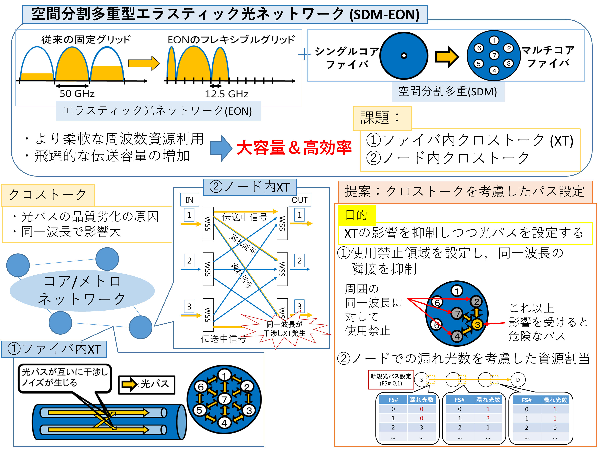
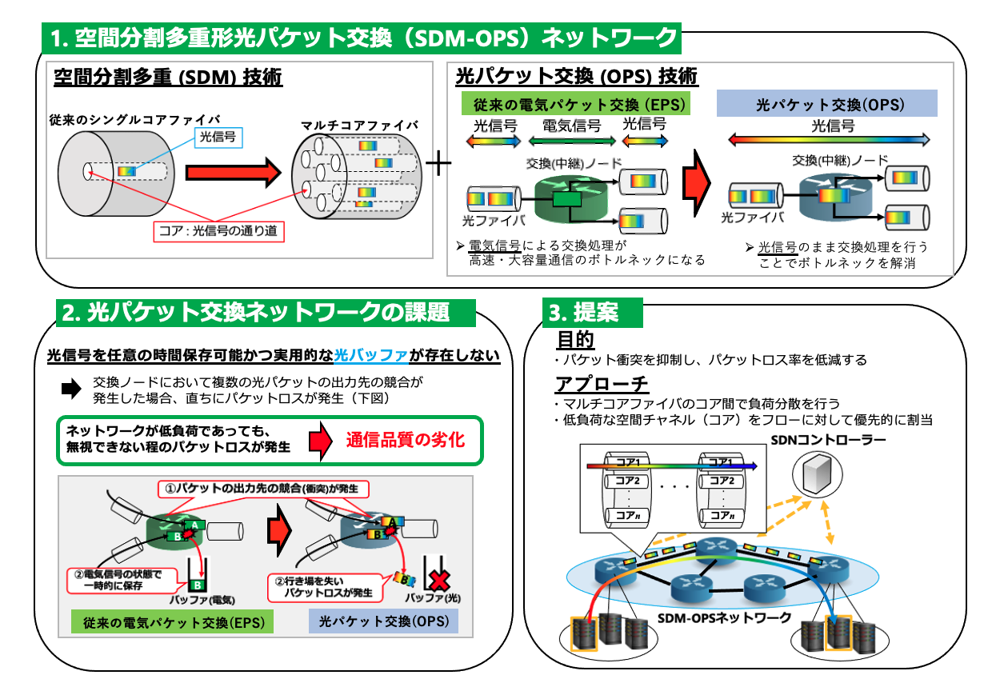
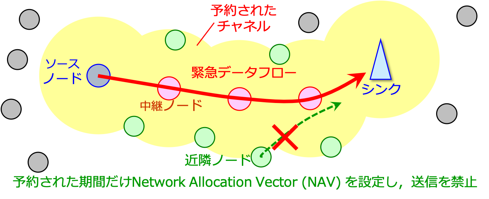
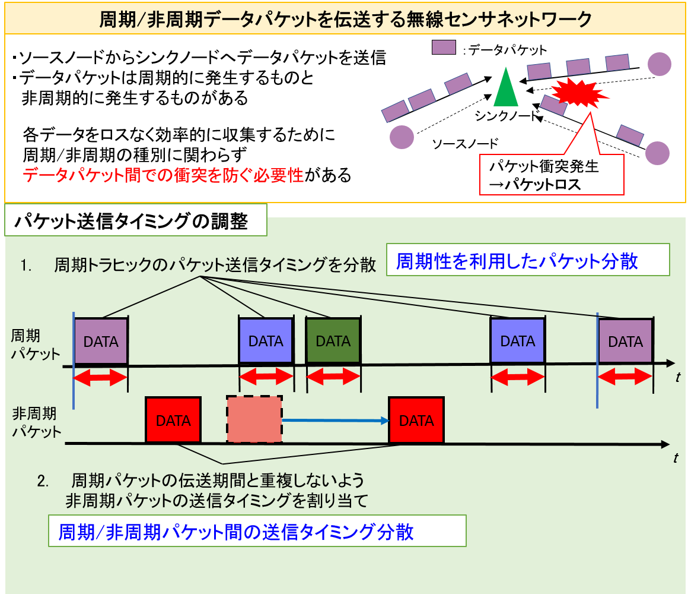

# 
 <h1>プロジェクト</h1> 

### <u>光ネットワーク</u>
#### 空間分割多重型エラスティック光網におけるファイバ内及びノード内のクロストークの影響を考慮した周波数資源割当手法に関する研究

	<figure>
		
		<figcaption>提案方式の概要．</figcaption>
	</figure>

トラフィックの飛躍的な増大に対処するため，空間分割多重型エラスティック光網に関する研究が盛んに進められています．しかし，マルチコアファイバ環境では，あるコアを通過する光パスの信号がその隣接コアに干渉することでノイズとなるファイバ内クロストーク (Crosstalk : XT)と，光交換ノードにおいて伝送されている光パスの''漏れ光''が所望の出力側スイッチ以外のスイッチへ漏れ出しそのスイッチの同一周波数スロットで伝送されている他の光パスと干渉することでノイズとなるノード内クロストークが発生し，通信品質の劣化原因となります．前者の問題を解決する手法として，本研究室は劣化の恐れがある光パスを保護することを目的として使用禁止領域の概念を導入したXT-Aware First Fit (FF)を提案しています．更にこのXT-Aware FFに''ノード内干渉源コスト''の概念を導入することで，ノード内クロストークの影響が大きくなると予想される光パスの設定を行わないように制御する周波数資源割当手法を提案しています．

#### 空間分割多重型光パケット交換網のための光パケット衝突を考慮した空間チャネル資源割当手法に関する研究

	<figure>
		
		<figcaption>提案方式の概要．</figcaption>
	</figure>

ファイバ容量のさらなる拡大，並びに時間領域におけるより効率的かつ柔軟なサービスの収容を目指し，空間分割多重型光パケット交換網に関する研究開発が進められています．光パケット交換技術は，これまで電気信号の状態で行われていた中継ノードにおける交換処理を，光信号の状態で行う次世代技術です．しかし，従来の電気パケット交換で用いられているRAM (Random Access Memory) のような，光パケットを任意の期間保存しランダムアクセスを可能にする光バッファは未だ実用化されておらず，研究開発が進められている最中です。そのため光パケット交換網においては，従来の電気パケット交換網ではパケットロスが発生しないような低負荷領域であっても，無視できない程のパケットロスが発生し通信品質が劣化する可能性があります。以上の問題を解決する手法として，本研究室では網内の負荷状況を考慮したフロー単位の空間チャネル資源割当手法を提案しています．また提案した手法について，情報通信研究機構の保有する光ネットワークテストベッドを用いた基本機能検証を実施し、その有効性並びに実現可能性を確認しています。

### <u>無線ネットワーク</u>
#### 無線センサ網におけるチャネル予約に基づく緊急データ絶対優先伝送法に関する研究

	<figure>
		
		<figcaption>緊急フロー経路上の隣接ノード相互のMAC連携に基づく絶対的な緊急フレーム伝送法．</figcaption>
	</figure>

Internet of Things (IoT)の普及，発展に伴い，無線センサネットワークの需要が増加しています．今後の無線センサ量とトラフィック量は爆発的に増加すると予期されており，ネットワークの形態とアプリケーションは多様化すると考えられます．特に，ヘルスケアや工場で使用される無線センサネットワークでは，患者の容態変化の検知や，災害発生の通知といった緊急性の高いデータを低遅延，低ロス率で伝送する仕組みが，新たに必要とされています．
	
そこで本研究室は，緊急フロー経路上の隣接ノード相互のMedium Access Control (MAC)連携に基づく絶対的な緊急フレーム伝送法を提案しています．この提案手法によって，End-to-End間の経路に沿って無線チャネルを時間的かつ空間的に一時予約することで，緊急フレームを送信するノードが無線チャネルを排他的に利用することができます（上図）．つまり，提案手法では近隣ノードの通常のフレーム送信を禁止するため，緊急フローは原理的な最小遅延で伝送されます．

#### 周期/非周期データパケットを伝送する無線センサネットワークに関する研究

	<figure>
		
		<figcaption>提案方式の概要．</figcaption>
	</figure>

Internet of Things (IoT) の普及，発展に伴い，ヘルスケアやスマートホームなどの用途で，データを周期的に生成，伝送，収集する無線センサネットワークの需要が増加しています．このような無線センサネットワークでは，上記のような周期的なトラヒックに加えて， イベント検出など非周期的に生成されたデータが伝送されることもあります．このような周期トラヒックと非周期トラヒックが混在する無線センサネットワークにおいて各データをロ スなく効率的に収集するためには，周期/非周期の種別に関わらずデータパケット間で衝突を防ぐ必要があります． そこで本研究室は，データを生成する各ソースノードのアプリケーション層において周期 パケットと非周期パケットの送信タイミングが重複しないように調整することで，周期/非周期の種別に関わらずパケット間の衝突を回避する手法を提案しています．まず，各周期トラヒックのパケット送信タイミングをパケット伝送期間が互いに重複しないよう時間軸上で 分散させることで周期トラヒックのパケット間の衝突を回避します．さらに，周期パケットが伝送されない期間に非周期パケットを送信することで，非周期パケット間および非周期パ ケットと周期パケット間の送信タイミングも重複しないように調整します．この提案手法により，非周期パケットと周期パケット両方のパケットロスを抑制できます．

### <u>情報指向ネットワーク</u>
#### Named Data Networkingにおけるエッジコンピューティング資源探索に関する研究

	<figure>
		
		<figcaption>提案資源探索手法の概要．</figcaption>
	</figure>

コネクテッドカーや仮想現実，拡張現実等のアプリケーションを実現する手法の1つとして，Named Data Networking (NDN)を利用したエッジコンピューティングが注目されています．既存のエッジコンピューティングフレームワークでは，エッジコンピューティングノードの資源状況 (e.g., CPUやメモリ利用状況)を考慮して要求パケットを転送することは実現されておらず，空き資源を有さないエッジコンピューティングノードに要求パケットが到着し，その要求を処理することができない可能性が生じます．本研究室では，NDNにおけるエッジコンピューティング資源探索を実現する手法を提案します．本提案手法は，上図のようにエッジコンピューティングノードが自身の資源状況をscoped-floodingによってその近傍に拡散し，その情報を元に要求パケットの要件を満たすエッジコンピューティングノードへ当該要求パケットを転送することを促します．コンピュータシミュレーションにより，提案手法は要求パケットの効率的なエッジコンピューティングノード探索を可能にすることを示しています．

### <u>ネットワークセキュリティ</u>
#### DNSトンネリング経由標的型攻撃に関する研究

	<figure>
		
		<figcaption>DNSトンネリング経由標的型攻撃の概要．</figcaption>
	</figure>

標的型攻撃による情報漏洩問題は極めて深刻な社会問題であり，その中でもDomain Name System (DNS)トンネリングを利用した情報漏洩が確認されています．DNSトンネリングは，DNSクエリ中のドメイン名と対応するDNSレスポンスを利用することによって，データ等をトンネリングする技術です．上図はDNSトンネリング経由標的型攻撃の概要を示しています．マルウェアが企業ネットワーク内にすでに侵入し，攻撃者との通信経路を作成するために，事前に共有したドメイン名attacker.comを利用すると仮定します．例えば，(1) マルウェアが機密情報を取得するために実行すべきコマンドを攻撃者から得る場合，マルウェアは*(get_command)*.attacker.comというFully Qualified Domain Name (FQDN)を生成し，企業ネットワーク内のDNSキャッシュサーバにDNSクエリとして送信します．そして，そのDNSキャッシュサーバは，受信したDNSクエリ中のFQDNに対応するIPアドレスを取得するために，通常の名前解決手順に沿って，(2), (3) root，(4), (5) com，そして (6) attacker.com DNSサーバに対して反復問い合わせを行います．attacker.com DNSサーバは*(get_command)*という情報を取得し，そのクエリに対してコマンドを含むDNSレスポンスを作成し，(7) DNSキャッシュサーバにそのレスポンスを送信し，(8) そのDNSキャッシュサーバを経由してマルウェアに送信します．（*(get_command)*を漏洩情報に置き換えて）上記のプロセスを繰り返すことで，最終的に，マルウェアは顧客情報等の漏洩情報の取得を完了します．このDNSトンネリングは，標的型攻撃を実現するだけではなく，例えばインターネット利用料を支払わなければインターネットにアクセスできない環境（公共のWi-Fiサービス等）においてただ乗りを実現することができます．そのため，DNSトンネリング自体の関連研究は複数存在し，有効な検知手法が提案されています．しかしこれらの手法は，特定マルウェアや特定トンネリングツールから得られる特徴量を元に構築されているため，攻撃者はこのような特徴量を生み出さないマルウェア（例えば，一般ユーザの行動を模倣するマルウェア）を作成して，検知手法をバイパスすることは容易であると考えます．そのため，様々な未知のDNSトンネリングトラフィックに対しては対処できないという根本的な問題が存在します．そこで本研究室では，特定のDNSトンネリングトラフィックに依存しない汎用性のあるDNSトンネリング検知手法を設計し，情報漏洩を防止することを目指しています．

#### DNS水責め攻撃に対抗するDNSキャッシュサーバ上でのFQDNベースホワイトリストフィルタに関する研究

	<figure>
		
		<figcaption>DNS水責め攻撃の概要．</figcaption>
	</figure>

Distributed Denial of Service (DDoS)攻撃は大きな社会問題であり，実際の攻撃事例の1つとして，2016年に多数の著名なサイトが利用していたDomain Name System (DNS)事業者であるDyn DNSがDNS DDoS攻撃を受け，大多数の人のサイトへのアクセスが不能になりました．本研究室ではこのDyn DNSへの攻撃に利用されていたDNS水責め攻撃をDDoS攻撃モデルとして考えます．DNS水責め攻撃は，攻撃者があるドメインにランダムなラベルを付加したユニークなFully Qualified Domain Name (FQDN)を大量に作成し，攻撃目標であるDNSキャッシュサーバや権威DNSサーバに対して当該FQDNを用いて作成された攻撃DNSクエリを送信しダウンさせます（上図）．この攻撃の影響を最小限に抑制するために，DNSキャッシュサーバ上での防御手法について検討されていますが，既存対抗手段は高度なDNS水責め攻撃によって作成された攻撃DNSクエリを検知できない可能性があり，依然としてDNS水責め攻撃の脅威は残ります．そこで本研究室では，実際にアクセスのあったFQDNのみをホワイトリストに登録し，攻撃検知状態においては，このリストを事前にチェックすることで攻撃者が作成した可能性の高い未登録のFQDNを棄却するFQDNベースホワイトリストフィルタを提案します．提案ホワイトリストは，攻撃DNSクエリを排除しつつ，通常ユーザから生じる通常DNSクエリを誤って排除することの影響を小さくすることができます．